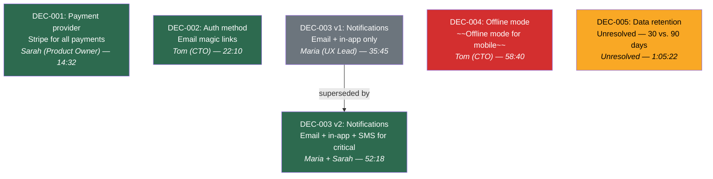

# Decision Log — [Workshop Name]

> Tracks all business decisions made during discovery. The current version of each decision is always the active one. Superseded versions are preserved for full traceability. Each decision includes its precise source.

## Summary

| ID | Topic | Status | Current Decision | Made By | Source |
|---|---|---|---|---|---|
| DEC-001 | Payment provider | 🟢 Active | Use Stripe for all payment processing | Sarah (Product Owner) | Transcript 14:32 |
| DEC-002 | User authentication method | 🟢 Active | Use email magic links for passwordless auth | Tom (CTO) | Transcript 22:10 |
| DEC-003 | Notification channel | 🟢 Active | Use email, in-app, AND SMS notifications for critical alerts | Maria (UX Lead), Sarah (Product Owner) | Transcript 52:18 |
| DEC-004 | Offline mode support | 🔴 Revoked | ~~Support offline mode for mobile users~~ | Tom (CTO) | Transcript 58:40 |
| DEC-005 | Data retention period | ⚠️ Unresolved | No agreement — 30 days vs. 90 days | — | Transcript 1:05:22 |

---

## Decisions

### DEC-001: Payment provider

**Status**: 🟢 Active
**Current Decision**: Use Stripe for all payment processing
**Made By**: Sarah (Product Owner)
**Source**: Transcript 14:32 — _"We agreed to go with Stripe for everything — EU and US. Simplifies the integration."_
**Affected Stories**: _to be linked during task extraction_

#### Version History

| Version | Decision | Made By | Source | Date | Superseded By |
|---|---|---|---|---|---|
| v1 (current) | Use Stripe for all payment processing | Sarah (Product Owner) | Transcript 14:32 | 2025-03-10 | — |

> No prior versions — this was decided once.

---

### DEC-002: User authentication method

**Status**: 🟢 Active
**Current Decision**: Use email magic links for passwordless auth
**Made By**: Tom (CTO)
**Source**: Transcript 22:10 — _"Magic links. No passwords. We'll use a service like Stytch or build on top of NextAuth."_
**Affected Stories**: _to be linked during task extraction_

#### Version History

| Version | Decision | Made By | Source | Date | Superseded By |
|---|---|---|---|---|---|
| v1 (current) | Use email magic links for passwordless auth | Tom (CTO) | Transcript 22:10 | 2025-03-10 | — |

---

### DEC-003: Notification channel

**Status**: 🟢 Active
**Current Decision**: Use email, in-app, AND SMS notifications for critical alerts
**Made By**: Maria (UX Lead), Sarah (Product Owner)
**Source**: Transcript 52:18 — _"Actually, for critical alerts like payment failures we need SMS too. Maria and I discussed this offline."_
**Affected Stories**: _to be linked during task extraction_

#### Version History

| Version | Decision | Made By | Source | Date | Superseded By |
|---|---|---|---|---|---|
| v2 (current) | Use email, in-app, AND SMS for critical alerts | Maria (UX Lead), Sarah (Product Owner) | Transcript 52:18 | 2025-03-10 | — |
| v1 | Use email and in-app notifications only | Maria (UX Lead) | Transcript 35:45 | 2025-03-10 | v2 |

---

### DEC-004: Offline mode support

**Status**: 🔴 Revoked
**Current Decision**: ~~Support offline mode for mobile users~~
**Made By**: Tom (CTO)
**Source**: Transcript 58:40 — _"We're dropping offline mode — too expensive for the current phase. Not worth the complexity."_
**Affected Stories**: _none — decision revoked before task extraction_

#### Version History

| Version | Decision | Made By | Source | Date | Superseded By |
|---|---|---|---|---|---|
| v1 | Support offline mode for mobile users | Tom (CTO) | Transcript 28:15 | 2025-03-10 | — (revoked) |

> v1 was initially Active, then revoked at 58:40 when cost concerns were raised.

---

### DEC-005: Data retention period

**Status**: ⚠️ Unresolved
**Current Decision**: No agreement — 30 days vs. 90 days
**Made By**: —
**Source**: Transcript 1:05:22 — _Sarah: "30 days should be enough." Tom: "No, we need 90 days minimum for compliance." No resolution recorded._
**Affected Stories**: _to be linked during task extraction_

#### Version History

| Version | Decision | Made By | Source | Date | Superseded By |
|---|---|---|---|---|---|
| v1 (current) | No agreement — 30 days vs. 90 days | — | Transcript 1:05:22 | 2025-03-10 | — |

> Two speakers disagreed; no resolution was recorded during the workshop.

---

## Decision Diagram

> **Legend**: 🟢 Green = Active decision | ⚫ Gray = Superseded version | 🔴 Red = Revoked decision | ⚠️ Yellow = Unresolved decision
> **Arrows** show supersession: older → newer

---

## Changelog

| Date | Change | By |
|---|---|---|
| 2025-03-10 | Initial decision log created from workshop transcript | Agent |
| 2025-03-10 | DEC-003 superseded: added SMS for critical alerts | Agent |
| 2025-03-10 | DEC-004 revoked: offline mode dropped due to cost | Agent |
| 2025-03-10 | DEC-005 created as unresolved: data retention period disagreement | Agent |
