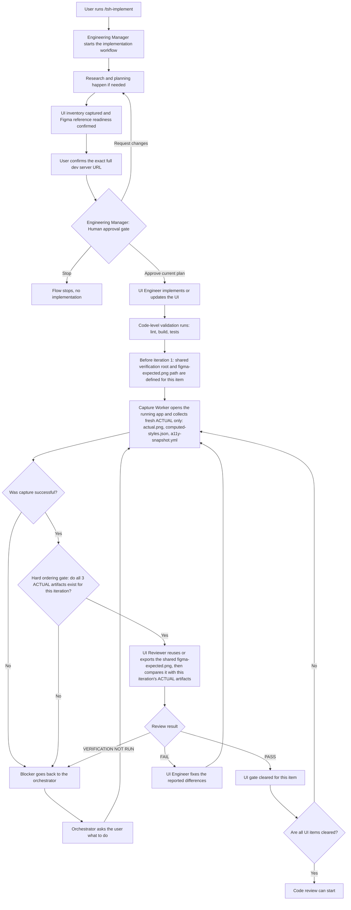

This page explains the exact post-implementation UI verification loop for Figma-backed UI work. It covers who does what, which artifacts are produced, when the flow blocks, and how the fix -> capture -> review loop closes.

This loop is reached through the canonical `/tsh-implement` workflow. Missing research or plan companions trigger preparation and never authorize no-plan implementation. Both Quick and Full routes require Human approval of the exact current plan revision before the first file-changing delegation; automated Reviewer approval is not permission to implement. A material revision after Human approval requires Reviewer re-review and renewed Human approval before work resumes.

:::info Mermaid Rendering
The diagrams below are authored in Mermaid. They render correctly in GitHub-flavored Markdown and many Markdown viewers. In the current documentation-site configuration, Mermaid support is not enabled yet, so these blocks may appear as code blocks on the published site until Mermaid is enabled there.
:::

## Why This Flow Exists

Build, lint, unit tests, and code review do **not** prove that the UI matches Figma. This flow exists to enforce a separate UI gate based on:

- **EXPECTED** from Figma MCP
- **ACTUAL** from live CLI capture against the running app
- A structured reviewer pass that compares structure, layout, dimensions, visuals, and component usage

The item is done only when the UI gate returns `PASS`, or when the user explicitly acknowledges a blocker and the item is marked `ESCALATED`.

## User-Friendly Graph



## Step-by-Step Flow

### 1. The Workflow Starts in `/tsh-implement`

The entrypoint is `/tsh-implement`, which runs the Engineering Manager through the canonical orchestration skill.

The orchestrator:

- checks whether research and plan artifacts already exist
- fills missing context through Context Engineer and Architect when needed
- captures the UI inventory — every `[REUSE]` UI task and every Figma URL — and confirms Figma reference readiness
- asks for the **exact full dev server URL** once the UI inventory is non-empty, after UI/Figma readiness is confirmed and before the Human approval gate
- presents the Human approval gate for the exact current plan revision, offering exactly `Approve current plan`, `Request changes`, `Stop`
- delegates UI implementation to the UI Engineer only after `Approve current plan`

The URL is a **pinned session input**. Once confirmed, it must be forwarded unchanged through every capture and review pass.

### 2. UI Engineer Implements the UI Slice

The UI Engineer owns implementation work only. It can:

- implement the requested UI changes
- run local code validation such as lint, build, or tests
- delegate capture and review after each UI pass

It does **not** close the item just because the code compiles.

### 3. Before Capture: the Shared Verification Root and Expected Reference Are Defined Once

Before the first capture pass for a `[REUSE]` UI verification item, the orchestrator defines the shared verification root, `specifications/<task-id>/ui-verification/`, and the reusable `figma-expected.png` path inside it. This convention is fixed for the item: every later iteration reuses the same shared root and the same `figma-expected.png` path while the Figma URL/node stays unchanged, and no iteration creates its own copy of the Figma reference image.

This step only establishes the shared path. It does not capture ACTUAL evidence and does not fetch EXPECTED from Figma — those happen in the capture and reviewer steps below.

### 4. Capture Worker Collects ACTUAL Evidence Only

`tsh-ui-capture-worker` is delegated first, for every iteration. It is a mechanical evidence collector: it never judges visual correctness, and it does not produce or touch `figma-expected.png`.

It must collect all three ACTUAL artifacts into the current iteration directory:

- `actual.png`
- `computed-styles.json`
- `a11y-snapshot.yml`

The canonical artifact directory is:

```text
specifications/<task-id>/ui-verification/iteration-<N>/
```

The capture flow is:

1. create the iteration directory
2. open a named Playwright CLI session
3. resize to the Figma frame width
4. go to the pinned full URL
5. stabilize the render
6. save screenshot, accessibility snapshot, and computed styles
7. confirm the files exist in the iteration directory
8. clean up the session

If even one required artifact is missing, the verification is invalid.

**Hard ordering gate (do not skip):** the reviewer must not be invoked until this capture pass has completed for the current iteration AND `actual.png`, `computed-styles.json`, and `a11y-snapshot.yml` are all confirmed present in the iteration directory. Invoking the reviewer without these artifacts is a process error — the reviewer returns `VERIFICATION NOT RUN` and no comparison happens.

### 5. Authentication and Access Gates Are Hard Blockers

Neither the orchestrator nor the capture/review workers may bypass, fake, seed, inject, or otherwise work around a login or access/permission gate.

**Default path — repo-root `.env`:** if capture hits a standard login redirect, it derives one env var per required field using `TSH_UI_LOGIN_<NORMALIZED_FIELD_KEY>` — the field key comes from `name` -> `autocomplete` -> `id` -> visible label text, normalized to uppercase snake case — and returns those exact names to the caller. The caller uses `vscode/askQuestions` to ask the user to add exactly those vars to repo-root `.env` and confirm when the file is saved. Once confirmed, capture reruns and reloads `.env` automatically, so the new values take effect without the user pasting secrets into chat.

**Fallbacks for non-standard auth:** direct manual login in the open browser session, or an already-authenticated storage-state path, are used only for non-standard flows — SSO, MFA, captcha — or when the field keys or `.env` cannot be derived or loaded reliably. A genuine login through the app's real sign-in UI is always allowed; bypassing the gate never is.

If the worker notices that the gate is trivially bypassable, it must report that as a **potential security vulnerability** in the same blocker message. It may never exploit that weakness.

### 6. Reviewer Reuses or Prepares EXPECTED, Then Compares Against This Iteration's ACTUAL

`tsh-ui-reviewer` is delegated only after the hard ordering gate in step 4 is satisfied. It is the design judge and must obtain EXPECTED from Figma MCP, not from a browser screenshot.

`figma-expected.png` is the single shared artifact at the path defined in step 3 — `specifications/<task-id>/ui-verification/figma-expected.png` — and reused across every iteration for this item while the Figma URL/node stays unchanged. It is never re-exported on every pass and never duplicated into `iteration-<N>/`.

Before comparing, the reviewer ensures that shared file exists: if it is already present and the Figma URL/node is unchanged, it reuses it as-is; only when it is missing, or the Figma URL/node changed, does the reviewer export it from Figma MCP. If Figma MCP is unavailable or the node cannot be resolved, the result is `VERIFICATION NOT RUN`.

The reviewer then compares that EXPECTED reference against the current iteration's ACTUAL artifacts (`actual.png`, `computed-styles.json`, `a11y-snapshot.yml`) produced in step 4 — never against artifacts from a prior iteration.

### 7. Reviewer Compares in a Fixed Order

The reviewer compares the implementation against Figma in this order:

1. Structure
2. Layout
3. Dimensions
4. Visual
5. Components

It uses:

- multimodal comparison of `figma-expected.png` and `actual.png`
- `computed-styles.json` for measured sizes and layout values
- `a11y-snapshot.yml` for structure and grouping

This order matters because a visually similar screen can still be structurally wrong.

### 8. Reviewer Returns One of Three States

The reviewer returns exactly one of these outcomes:

- `PASS` — the item matches Figma within the allowed tolerances
- `FAIL` — there are actionable mismatches to fix
- `VERIFICATION NOT RUN` — the review could not be completed on trustworthy evidence

`VERIFICATION NOT RUN` is a blocker state, not a visual verdict.

### 9. FAIL Starts Another Iteration

If the reviewer returns `FAIL`:

1. UI Engineer applies fixes
2. Capture Worker runs again on a fresh iteration
3. Reviewer runs again on the fresh artifacts

This loop repeats until:

- the item becomes `PASS`, or
- the flow reaches the 5-iteration budget and moves to a structured user gate

### 10. The 5-Iteration Limit

After 5 full FAIL iterations, the flow must stop and ask the user what to do next.

The user gate offers:

- continue with an explicit extra iteration count
- stop and accept the item as `ESCALATED`
- provide a custom instruction

This prevents infinite loops and keeps the user in control of tradeoffs.

### 11. Code Review Starts Only After the UI Gate Clears

Code review is a separate gate. It starts only after every Figma-backed UI item is either:

- `PASSED`, or
- explicitly acknowledged as `ESCALATED`

Build success, lint success, tests, and code review do not substitute for UI verification.

## Artifacts and Outputs

### Artifact Layout

```text
specifications/<task-id>/ui-verification/
  figma-expected.png
  iteration-<N>/
    actual.png
    computed-styles.json
    a11y-snapshot.yml
    report.md
```

`figma-expected.png` is a single shared artifact reused across every iteration for the same item while the Figma URL/node stays unchanged; it is never duplicated into `iteration-<N>/`.

### Who Produces What

| Owner | Input | Output |
| --- | --- | --- |
| Engineering Manager | task description, Jira ID, standalone `*.research.md`, or `*.plan.md` | routing, gates, user questions, and — once per item, before iteration 1 — the shared verification root and `figma-expected.png` path |
| UI Engineer | plan + UI task slice | code changes |
| UI Capture Worker | pinned full URL + iteration dir | `actual.png`, `computed-styles.json`, `a11y-snapshot.yml` for this iteration only — never `figma-expected.png` |
| UI Reviewer | Figma URL + shared `figma-expected.png` path + current iteration's ACTUAL artifacts | reuses or exports `figma-expected.png` when needed, then `PASS`, `FAIL`, or `VERIFICATION NOT RUN` |

## Invariants

These rules are never optional:

- The pinned full dev server URL never changes during the loop.
- The shared verification root and `figma-expected.png` path are defined once, before iteration 1 for an item, and never redefined mid-loop.
- Capture worker always runs before reviewer, and the reviewer is never invoked until all three current-iteration ACTUAL artifacts are confirmed present.
- Review always uses fresh artifacts from the current iteration.
- EXPECTED always comes from Figma MCP and is stored once at the shared `ui-verification/figma-expected.png` root, reused across iterations while the Figma URL/node is unchanged.
- Auth and access gates are never bypassed; the default resolution path is repo-root `.env`.
- `VERIFICATION NOT RUN` never counts as `PASS`.
- Code review never starts before the UI gate clears.

## Source of Truth

This page summarizes the flow defined in these canonical files:

- [.github/prompts/tsh-implement.prompt.md](https://github.com/TheSoftwareHouse/copilot-collections/blob/main/.github/prompts/tsh-implement.prompt.md)
- [.github/skills/tsh-orchestrating-implementation/SKILL.md](https://github.com/TheSoftwareHouse/copilot-collections/blob/main/.github/skills/tsh-orchestrating-implementation/SKILL.md)
- [.github/skills/tsh-ui-verifying/SKILL.md](https://github.com/TheSoftwareHouse/copilot-collections/blob/main/.github/skills/tsh-ui-verifying/SKILL.md)
- [.github/agents/tsh-ui-engineer.agent.md](https://github.com/TheSoftwareHouse/copilot-collections/blob/main/.github/agents/tsh-ui-engineer.agent.md)
- [.github/agents/tsh-ui-capture-worker.agent.md](https://github.com/TheSoftwareHouse/copilot-collections/blob/main/.github/agents/tsh-ui-capture-worker.agent.md)
- [.github/agents/tsh-ui-reviewer.agent.md](https://github.com/TheSoftwareHouse/copilot-collections/blob/main/.github/agents/tsh-ui-reviewer.agent.md)
