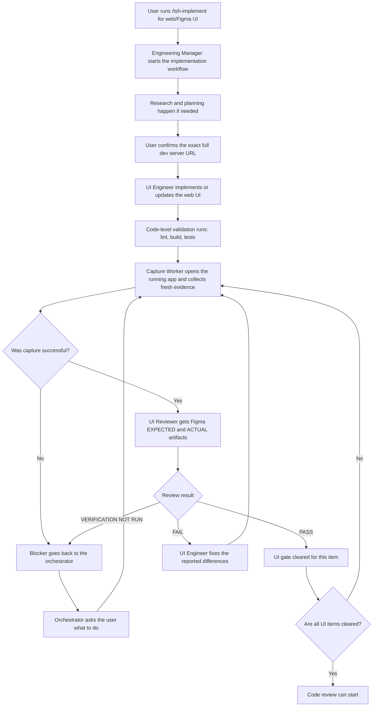

This page explains the exact post-implementation UI verification loop for Figma-backed UI work. It covers who does what, which artifacts are produced, when the flow blocks, and how the fix -> capture -> review loop closes.

:::info Mermaid Rendering
The diagrams below are authored in Mermaid. They render correctly in GitHub-flavored Markdown and many Markdown viewers. In the current documentation-site configuration, Mermaid support is not enabled yet, so these blocks may appear as code blocks on the published site until Mermaid is enabled there.
:::

## Why This Flow Exists

Build, lint, unit tests, and code review do **not** prove that the UI matches Figma. This flow exists to enforce a separate UI gate based on:

- **EXPECTED** from Figma MCP
- **ACTUAL** from live CLI capture against the running app
- A structured reviewer pass that compares structure, layout, dimensions, visuals, and component usage

The item is done only when the UI gate returns `PASS`, or when the user explicitly acknowledges a blocker and the item is marked `ESCALATED`.

## Platform Boundary

This page documents the collection's web/Figma browser verification contract only. The browser artifacts `actual.png`, `computed-styles.json`, and `a11y-snapshot.yml` are evidence about a web implementation. They cannot verify native React Native safe areas or status bars, platform navigation, device behavior, touch or gesture behavior, VoiceOver or TalkBack, simulator or device accessibility, or native end-to-end behavior.

Rendered React Native UI remains with the existing UI Engineer route, but it does not enter this browser verification flow. Native simulator or device, accessibility, and end-to-end evidence is target-project-owned. When the target project does not provide an explicit native evidence contract, record native verification as `VERIFICATION NOT RUN` or as an explicit prerequisite or limitation. This collection does not provide a native verification worker or automation promise.

## User-Friendly Graph



## Step-by-Step Flow

### 1. The Web Workflow Starts in `/tsh-implement`

The public entry point is `/tsh-implement`, which runs the Engineering Manager through the canonical orchestration skill. This page covers the web/Figma branch only; the canonical orchestrator keeps platform classification and routing in one place.

The orchestrator:

- checks whether research and plan artifacts already exist
- fills missing context through Context Engineer and Architect when needed
- asks for the **exact full dev server URL** when UI verification will be needed
- delegates UI implementation to the UI Engineer

The URL is a **pinned session input**. Once confirmed, it must be forwarded unchanged through every capture and review pass.

### 2. UI Engineer Implements the Web UI Slice

The UI Engineer owns web implementation work only in this flow. It can:

- implement the requested UI changes
- run local code validation such as lint, build, or tests
- delegate capture and review after each UI pass

It does **not** close the item just because the code compiles.

### 3. Capture Worker Collects ACTUAL Evidence

The Capture Worker is a mechanical browser evidence collector. It never judges visual correctness and its output is not native React Native evidence.

It must collect all three ACTUAL artifacts into the current iteration directory:

- `actual.png`
- `computed-styles.json`
- `a11y-snapshot.yml`

The canonical artifact directory is:

```text
specifications/<task-id>/ui-verification/iteration-<N>/
```

The capture flow is:

1. create the iteration directory
2. open a named Playwright CLI session
3. resize to the Figma frame width
4. go to the pinned full URL
5. stabilize the render
6. save screenshot, accessibility snapshot, and computed styles
7. confirm the files exist in the iteration directory
8. clean up the session

If even one required artifact is missing, the verification is invalid.

### 4. Authentication and Access Gates Are Hard Blockers

Neither the orchestrator nor the capture/review workers may bypass login or access control.

If the page requires authentication or a specific access level:

- the worker returns a blocker to the caller
- the caller uses `vscode/askQuestions` to ask the user how authentication should happen
- the user must decide the login method and provide what is needed
- the flow resumes only after the blocker is resolved

If the worker notices that the gate is trivially bypassable, it must report that as a **potential security vulnerability** in the blocker notes. It may never exploit that weakness.

### 5. Reviewer Collects EXPECTED from Figma

The Reviewer is the design judge. It must obtain EXPECTED from Figma MCP, not from a browser screenshot.

On every pass it ensures the shared verification root contains:

- `specifications/<task-id>/ui-verification/figma-expected.png`

If the export is missing, it exports it from Figma MCP before comparing. If Figma MCP is unavailable or the node cannot be resolved, the result is `VERIFICATION NOT RUN`.

### 6. Reviewer Compares in a Fixed Order

The reviewer compares the implementation against Figma in this order:

1. Structure
2. Layout
3. Dimensions
4. Visual
5. Components

It uses:

- multimodal comparison of `figma-expected.png` and `actual.png`
- `computed-styles.json` for measured sizes and layout values
- `a11y-snapshot.yml` for structure and grouping

This order matters because a visually similar screen can still be structurally wrong.

### 7. Reviewer Returns One of Three States

The reviewer returns exactly one of these outcomes:

- `PASS` — the item matches Figma within the allowed tolerances
- `FAIL` — there are actionable mismatches to fix
- `VERIFICATION NOT RUN` — the review could not be completed on trustworthy evidence

`VERIFICATION NOT RUN` is a blocker state, not a visual verdict.

### 8. FAIL Starts Another Iteration

If the reviewer returns `FAIL`:

1. UI Engineer applies fixes
2. Capture Worker runs again on a fresh iteration
3. Reviewer runs again on the fresh artifacts

This loop repeats until:

- the item becomes `PASS`, or
- the flow reaches the 5-iteration budget and moves to a structured user gate

### 9. The 5-Iteration Limit

After 5 full FAIL iterations, the flow must stop and ask the user what to do next.

The user gate offers:

- continue with an explicit extra iteration count
- stop and accept the item as `ESCALATED`
- provide a custom instruction

This prevents infinite loops and keeps the user in control of tradeoffs.

### 10. Code Review Starts Only After the UI Gate Clears

Code review is a separate gate. It starts only after every Figma-backed UI item is either:

- `PASSED`, or
- explicitly acknowledged as `ESCALATED`

Build success, lint success, tests, and code review do not substitute for UI verification.

## Artifacts and Outputs

### Required Files Per Iteration

```text
specifications/<task-id>/ui-verification/
  figma-expected.png
  iteration-<N>/
    actual.png
    computed-styles.json
    a11y-snapshot.yml
    report.md
```

### Who Produces What

| Owner               | Input                           | Output                                                                     |
| ------------------- | ------------------------------- | -------------------------------------------------------------------------- |
| Engineering Manager | task, Jira ID, or plan          | routing, gates, user questions                                             |
| UI Engineer         | plan + web UI task slice        | code changes                                                               |
| UI Capture Worker   | pinned full URL + iteration dir | browser `actual.png`, `computed-styles.json`, `a11y-snapshot.yml`          |
| UI Reviewer         | Figma URL + iteration dir       | web `PASS`, `FAIL`, or `VERIFICATION NOT RUN` report                       |

## Web/Figma Invariants

These rules are never optional for this web/Figma flow:

- The pinned full dev server URL never changes during the loop.
- Capture always happens before review.
- Review always uses fresh artifacts from the current iteration.
- EXPECTED always comes from Figma MCP.
- Auth and access gates are never bypassed.
- `VERIFICATION NOT RUN` never counts as `PASS`.
- Code review never starts before the UI gate clears.

These invariants do not create a native React Native verification contract. Native evidence remains the target project's responsibility.

## Source of Truth

This page summarizes the flow defined in these canonical files:

- [.github/prompts/tsh-implement.prompt.md](https://github.com/TheSoftwareHouse/copilot-collections/blob/main/.github/prompts/tsh-implement.prompt.md)
- [.github/skills/tsh-orchestrating-implementation/SKILL.md](https://github.com/TheSoftwareHouse/copilot-collections/blob/main/.github/skills/tsh-orchestrating-implementation/SKILL.md)
- [.github/skills/tsh-ui-verifying/SKILL.md](https://github.com/TheSoftwareHouse/copilot-collections/blob/main/.github/skills/tsh-ui-verifying/SKILL.md)
- [.github/agents/tsh-ui-engineer.agent.md](https://github.com/TheSoftwareHouse/copilot-collections/blob/main/.github/agents/tsh-ui-engineer.agent.md)
- [.github/agents/tsh-ui-capture-worker.agent.md](https://github.com/TheSoftwareHouse/copilot-collections/blob/main/.github/agents/tsh-ui-capture-worker.agent.md)
- [.github/agents/tsh-ui-reviewer.agent.md](https://github.com/TheSoftwareHouse/copilot-collections/blob/main/.github/agents/tsh-ui-reviewer.agent.md)
